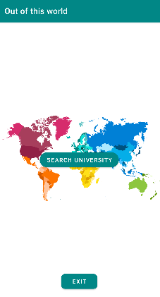

# UNIqueue

Basic Android Application guiding to info of a uni in one of 16 different countries from the world.
This repository contains all files and scripts needed for the app to run on Android Studio.

